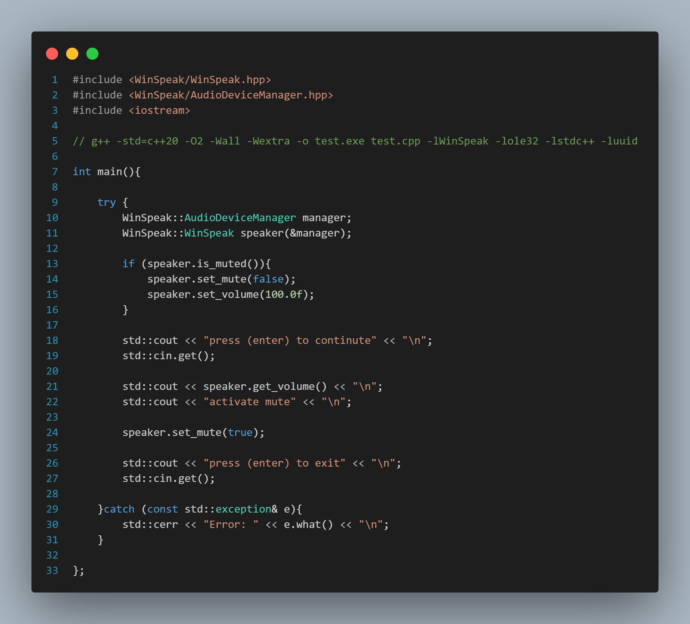

# WinSpeak

WinSpeak is a modern, powerful, and easy-to-use C++ library for controlling speakers in Windows. It allows you to manage volume, mute/unmute speakers, and query audio status simply, quickly, and securely.

## 🚀 Example Usage 

    

## 📚 WinSpeak documentation website

[https://tina-1300.github.io/documentation/WinSpeak/index.html](https://tina-1300.github.io/documentation/WinSpeak/index.html)

## 📢 WinSpeak Announcements

[https://tina-1300.github.io/documentation/Announcement-WinSpeak/Announcement-WinSpeak.html](https://tina-1300.github.io/documentation/Announcement-WinSpeak/Announcement-WinSpeak.html)

## 🌟 Support the project

>🚀 This project is under active development. If you like it, consider giving it a ⭐ to support its evolution and encourage contributions!

